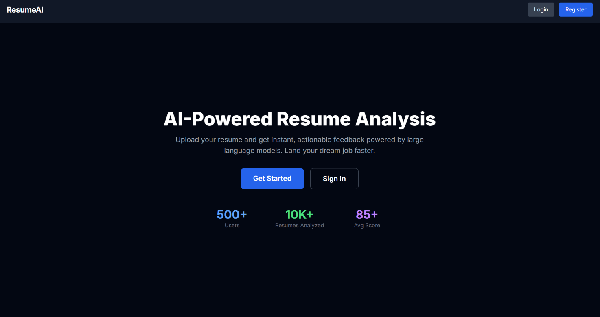
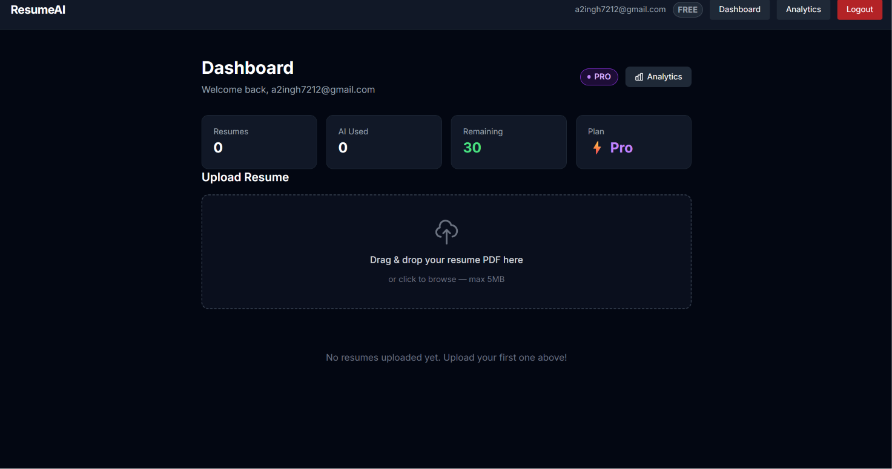
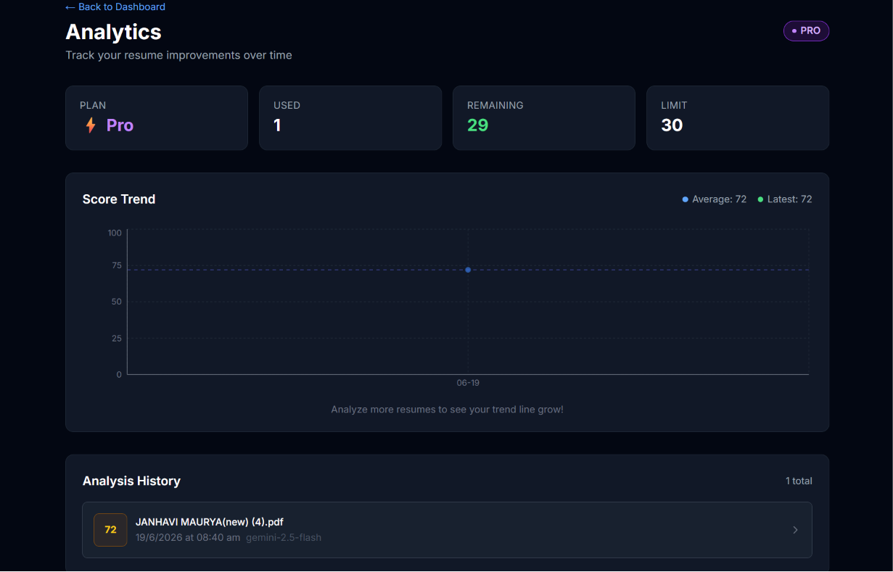
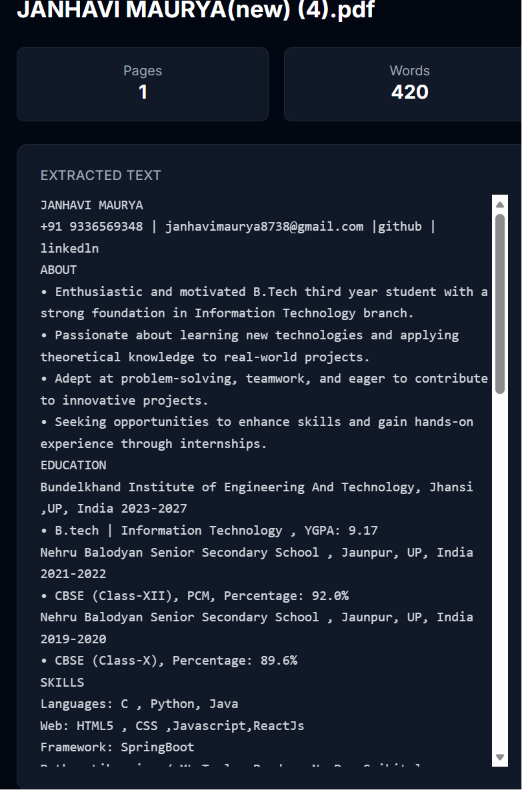
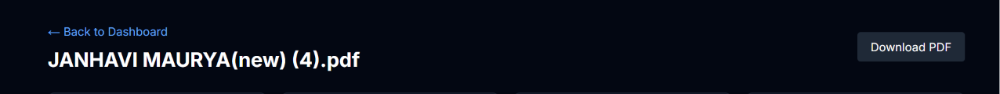

# ResumeAI — AI-Powered SaaS Resume Analysis Platform

> An AI-powered SaaS platform that analyzes resumes, scores them, identifies skill gaps, and provides actionable improvement suggestions — powered by Google Gemini.


---

## 🚀 Live Demo

**Frontend:** [https://resume-ai.vercel.app](https://resume-ai.vercel.app)
**Backend API:** [https://resume-ai-backend.up.railway.app/docs](https://resume-ai-backend.up.railway.app/docs)

---

## 📸 Screenshots

| Landing Page | Dashboard |
|---|---|
| *[]* | *[]* |

| AI Analysis (Streaming) | Score Trend Chart |
|---|---|
| *[]* | *[]* |

| Keyword Gap Analysis | PDF Export |
|---|---|
| *[]* | *[]* |

---

## 🏗 Architecture

┌─────────────────────────────────────────────┐
│                CLIENT LAYER                 │
├─────────────────────────────────────────────┤
│ Next.js 14 (App Router)                     │
│ React Dropzone • Recharts • jsPDF           │
│ NextAuth.js • SSE Client                    │
└─────────────────┬───────────────────────────┘
                  │ REST / JWT / SSE
                  ▼
┌─────────────────────────────────────────────┐
│               FASTAPI BACKEND               │
├─────────────────────────────────────────────┤
│ JWT Authentication                          │
│ Rate Limiting                               │
│ PDF Extraction (pdfplumber)                 │
│ Gemini 1.5 Flash Analysis                   │
│ Cloudinary Integration                      │
└───────┬─────────────────┬───────────────────┘
        │                 │
        ▼                 ▼
┌──────────────┐   ┌──────────────┐
│ PostgreSQL   │   │ MongoDB      │
│ (Supabase)   │   │ (Atlas)      │
├──────────────┤   ├──────────────┤
│ Users        │   │ Resumes      │
│ Plans        │   │ Analyses     │
│ Rate Limits  │   │              │
└──────────────┘   └──────────────┘
        │
        ▼
┌──────────────┐
│ Cloudinary   │
├──────────────┤
│ PDF Storage  │
└──────────────┘


---

## 🧰 Tech Stack

| Layer | Technology |
|-------|-----------|
| Frontend | Next.js 14, TypeScript, Tailwind CSS, React Dropzone |
| Charts | Recharts |
| Auth | JWT + NextAuth.js (Google OAuth) |
| Backend | FastAPI, Python 3.11 |
| AI | Google Gemini 1.5 Flash (free tier) |
| Database | PostgreSQL (Supabase) + MongoDB Atlas |
| Storage | Cloudinary (free tier) |
| PDF Parse | pdfplumber |
| PDF Export | jsPDF |
| Deployment | Vercel (frontend) + Railway (backend) |
| Load Testing | Locust |
| Containers | Docker Compose |

---

## 📂 Project Structure

resume-analyzer/
├── frontend/ # Next.js 14 App
│ ├── src/
│ │ ├── api/ # API client functions
│ │ ├── app/ # App Router pages
│ │ │ ├── dashboard/
│ │ │ │ ├── analytics/ # Analytics page
│ │ │ │ └── resume/[id]/ # Resume detail
│ │ │ ├── login/
│ │ │ └── register/
│ │ ├── components/ # React components
│ │ ├── hooks/ # Custom hooks
│ │ ├── lib/ # Axios config
│ │ ├── types/ # TypeScript types
│ │ └── utils/ # Export PDF, etc.
│ └── package.json
│
├── backend/ # FastAPI App
│ ├── app/
│ │ ├── auth/ # JWT, security, dependencies
│ │ ├── config/ # DB, MongoDB, settings
│ │ ├── models/ # SQLAlchemy models
│ │ ├── routes/ # API endpoints
│ │ ├── schemas/ # Pydantic schemas
│ │ └── utils/ # PDF parser, prompts, rate limit
│ ├── requirements.txt
│ └── Dockerfile
│
├── loadtest/ # Locust load tests
│ ├── locustfile.py
│ └── RESULTS.md
│
├── docker-compose.yml # Local dev environment
└── README.md


---

## ⚡ Getting Started

### Prerequisites

- Node.js 20+
- Python 3.11+
- PostgreSQL (or Supabase account)
- MongoDB (or Atlas account)
- Cloudinary account (free)
- Google Gemini API key (free)
- Google OAuth credentials (optional)

### Option 1: Docker Compose (Recommended)

```bash
# Clone the repo
git clone https://github.com/yourusername/resume-analyzer.git
cd resume-analyzer

# Create .env file (see .env.example)
cp .env.example .env
# Fill in your API keys

# Start all services
docker-compose up --build

# Open http://localhost:3000

# 1. Start backend
cd backend
python -m venv venv
source venv/bin/activate
pip install -r requirements.txt
cp .env.example .env  # Fill in your values
uvicorn app.main:app --reload --port 8000

# 2. Start frontend
cd frontend
npm install
cp .env.example .env.local  # Fill in your values
npm run dev

# Open http://localhost:3000


🔑 Environment Variables
Backend (backend/.env)
env

DATABASE_URL=postgresql://...
MONGODB_URI=mongodb+srv://...
MONGODB_DB=resume_ai
SECRET_KEY=your-secret-key
ALGORITHM=HS256
ACCESS_TOKEN_EXPIRE_MINUTES=30
REFRESH_TOKEN_EXPIRE_DAYS=7
CLOUDINARY_CLOUD_NAME=xxx
CLOUDINARY_API_KEY=xxx
CLOUDINARY_API_SECRET=xxx
CLOUDINARY_FOLDER=resume_ai
GEMINI_API_KEY=AIza...
AI_DAILY_LIMIT=10
Frontend (frontend/.env.local)
env

NEXT_PUBLIC_API_URL=http://localhost:8000
NEXTAUTH_SECRET=your-secret
NEXTAUTH_URL=http://localhost:3000
GOOGLE_CLIENT_ID=xxx
GOOGLE_CLIENT_SECRET=xxx